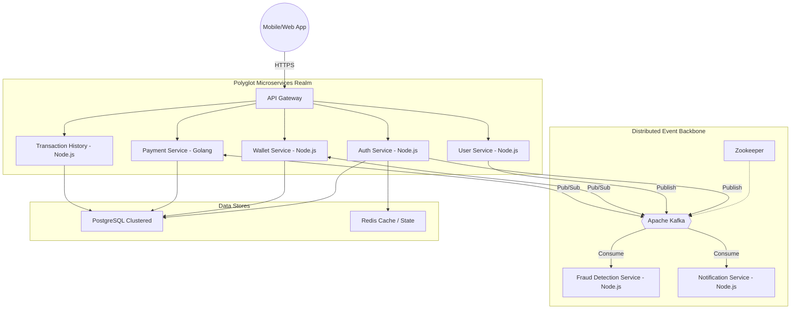
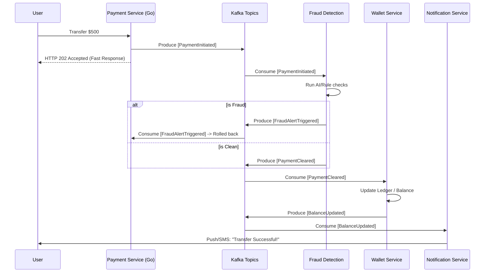
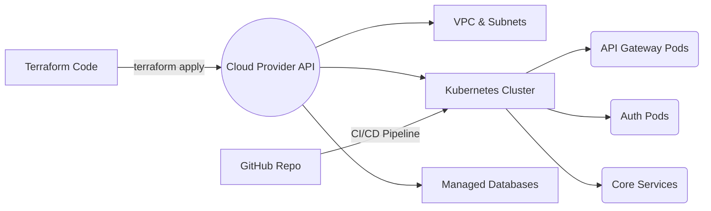

  <h1>🚀 PayFlow OS Infrastructure</h1>
  <h3>Production-Grade, Event-Driven Fintech Payment Platform</h3>
  
<strong>Built with ❤️ by Itoje Dollars</strong>

  
  

    
    
    
    
    
    
    
    
    
  

---

## 📖 Overview

**PayFlow** is an enterprise-grade fintech platform engineered for extreme high-throughput, low-latency financial transactions. Architected entirely as decoupled microservices, it leverages the power of distributed event streaming via Apache Kafka and infrastructure-as-code (IaC) utilizing Terraform & Kubernetes, allowing for true auto-scaling and unparalleled fault tolerance.

---

## 🏗️ High-Level System Architecture

PayFlow utilizes a hybrid Polyglot Microservices architecture.

---

## ⚡ The Distributed Brain: Apache Kafka

Kafka is the absolute core of our system, functioning as a fault-tolerant event bus that fully decouples domains. We adhere to **Event-Driven Architecture (EDA)** principles, meaning no direct synchronous communication happens for state changes—eliminating cascading failures and timeouts.

### Event Choreography Flow

### Why Kafka for FinTech?
1. **Durability & Replayability:** Using consumer offsets, if our fraud engine crashes, events queue up safely. Once rebooted, it resumes processing with zero data loss.
2. **Decoupling:** New domains (e.g., a Loyalty Point System) can simply subscribe to `[PaymentCleared]` events without any code changes in the Payment Service.
3. **Throughput:** Kafka achieves millions of reads/writes per second, handling massive transaction spikes dynamically.

---

## 🌍 Infrastructure & GitOps (Terraform + Kubernetes)

Our production environment is entirely declarative. We define hardware, networking, and cluster configurations as code using **Terraform (HCL)**. 

### Infra Provisioning Lifecycle

**Key Infrastructure Highlights:**
* **Terraform (`.tf`):** Automates the VNet/VPC, NAT Gateways, Kubernetes Clusters (EKS/AKS/GKE), ensuring ephemeral, reproducible environments.
* **Kubernetes (`.yaml`):** Self-healing orchestrator. We use Deployments, Services, and Horizontal Pod Autoscalers (HPA) to scale microservices seamlessly based on CPU/Memory and Kafka Lag metrics.
* **Service Mesh ready:** Configured for easily strapping on Istio or Linkerd for mTLS between microservices.

---

## 💻 Microservices Map
* **API Gateway (`port 3000`)**: Request routing, rate-limiting, edge-level security.
* **Auth Service (`port 3001`)**: JWT-based Authentication & RBAC.
* **User Service (`port 3002`)**: Identity & Profile Management (KYC integrated).
* **Wallet Service (`port 3003`)**: High-ACID compliant Ledger for balances and transactions.
* **Notification Service (`port 3004`)**: Multi-channel asynchronous alerts.
* **Fraud Detection Service (`port 3005`)**: Real-time anomaly detection intercepting Kafka events.
* **Transaction History (`port 3006`)**: Read-heavy CQRS projection for blazing-fast user transaction lookup.
* **Payment Service - Go (`port 8080`)**: High-performance payment settlement core & external banking orchestration.

---

  <i>"Architecture is about making the important stuff harder to change, so you get it right the first time."</i> 
  <b>— Itoje Dollars, Lead Architect</b>

