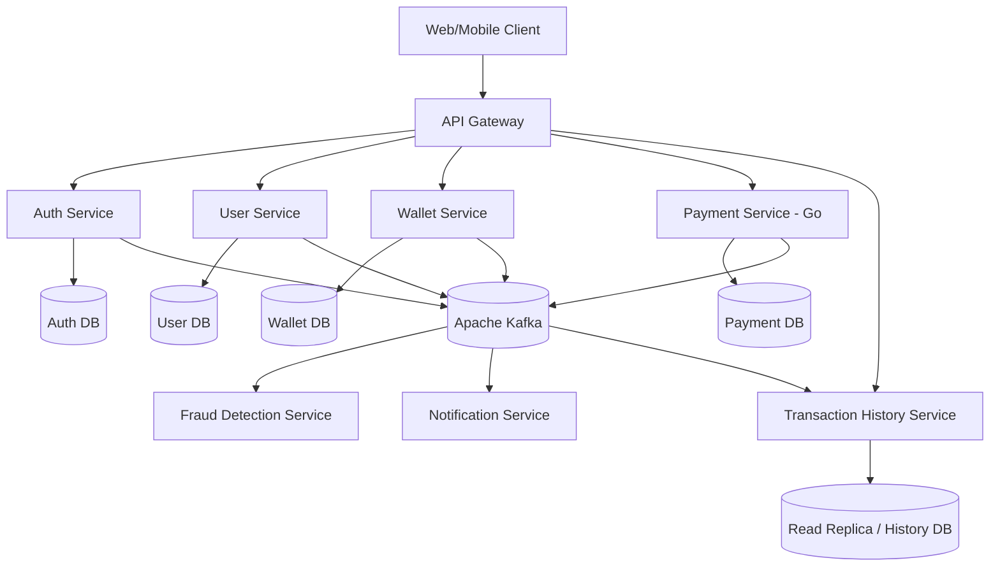

# PayFlow Architecture

```mermaid
graph TD
    Client[Web/Mobile Client] --> APIGateway[API Gateway]
    APIGateway --> Auth[Auth Service]
    APIGateway --> User[User Service]
    APIGateway --> Wallet[Wallet Service]
    APIGateway --> Payment[Payment Service - Go]
    APIGateway --> History[Transaction History Service]
    
    Auth --> DB_Auth[(Auth DB)]
    User --> DB_User[(User DB)]
    Wallet --> DB_Wallet[(Wallet DB)]
    Payment --> DB_Payment[(Payment DB)]
    History --> DB_History[(Read Replica / History DB)]

    Payment --> Kafka[(Apache Kafka)]
    Wallet --> Kafka
    User --> Kafka
    Auth --> Kafka

    Kafka --> Fraud[Fraud Detection Service]
    Kafka --> Notification[Notification Service]
    Kafka --> History
```
